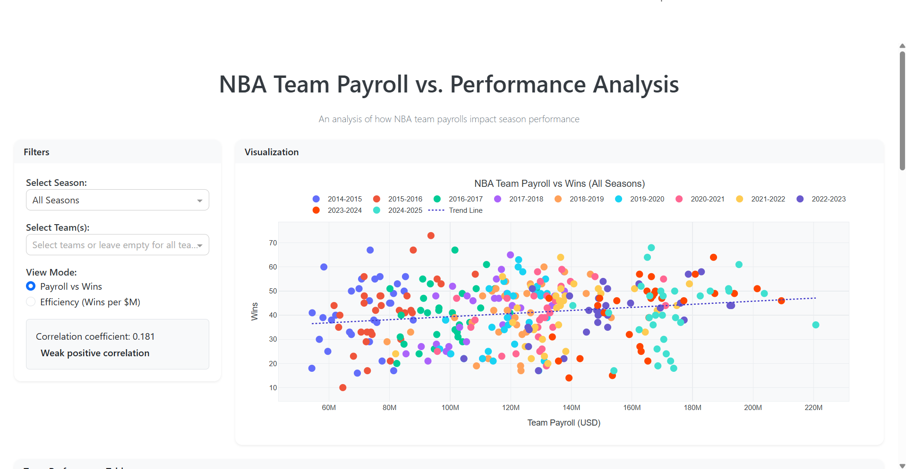

# NBA Team Payroll vs. Wins Interactive Dashboard

A comprehensive interactive dashboard analyzing the relationship between NBA team payrolls and wins across multiple seasons (2014-2025).

## 📊 Overview

This project explores whether money can buy wins in the NBA by analyzing team payroll data against regular season performance. The interactive dashboard provides insights into spending efficiency, correlation patterns, and team performance relative to expectations.

## 🚀 Features

- **Interactive Visualization**: Plotly-powered scatter plots and bar charts with hover details
- **Multi-Season Analysis**: Data spanning 11 NBA seasons (2014-2015 through 2024-2025)
- **Team Filtering**: Filter by specific teams or seasons for targeted analysis
- **Efficiency Metrics**: "Wins per million dollars" calculations to identify value
- **Statistical Analysis**: Correlation coefficients and trend line analysis
- **Performance Insights**: Identify overperforming and underperforming teams
- **Data Export**: CSV export functionality for further analysis
- **Responsive Design**: Professional dashboard interface built with Bootstrap

## 📸 Screenshots

### Dashboard Overview

*Interactive scatter plot showing payroll vs wins correlation with team filtering*

### Data Insights Panel

*Team efficiency rankings and performance analysis with correlation insights*

### Team Efficiency Analysis  

*Team efficiency ranking for 2019-20 season showing wins per million dollars spent*

## 🛠️ Technologies Used

- **Python 3.10+**
- **Dash**: Web application framework
- **Plotly**: Interactive data visualization
- **Pandas**: Data manipulation and analysis
- **NumPy**: Numerical computing
- **Dash Bootstrap Components**: Modern UI components
- **Scikit-learn**: Linear regression analysis

## 🏃‍♂️ Running the Application

1. Clone the repository:
```bash
git clone https://github.com/M-Eisa/NBA-Team-Payroll-vs.-Wins-Interactive-Dashboard.git
```

2. Install dependencies:
```bash
pip install -r requirements.txt
```

3. Run the application:
```bash
python nba_payroll_vs_wins.py
```

## 📈 Key Insights

### Correlation Analysis
- **Overall Correlation**: Weak positive correlation (r = 0.181) between payroll and wins
- **Season Variability**: Correlation strength varies significantly by season
- **Diminishing Returns**: Higher spending doesn't guarantee proportional success

### Efficiency Findings
- Teams with rookie contracts for star players often show highest efficiency
- Mid-market teams frequently outperform spending expectations
- High payrolls don't guarantee proportional regular season success

### Notable Patterns
- **Injury Impact**: High-payroll teams with injured stars often underperform
- **Development Success**: Teams with strong player development exceed payroll expectations
- **Coaching Effect**: Strategic coaching can maximize limited payroll effectiveness

## 🎯 Dashboard Components

### Main Visualization
- **Scatter Plot**: Payroll vs Wins with trend lines
- **Bar Chart**: Team efficiency rankings
- **Color Coding**: Season-based or team-based highlighting

### Interactive Filters
- **Season Selector**: Individual seasons or aggregate view
- **Team Filter**: Multi-select team comparison
- **View Mode**: Toggle between payroll/wins and efficiency views

### Analytics Panel
- **Correlation Display**: Real-time correlation calculations
- **Summary Statistics**: Payroll and performance metrics
- **Performance Analysis**: Overperforming and underperforming teams identification

## 📊 Data Sources

- **Payroll Data**: HoopsHype salary database
- **Win Records**: NBA.com official standings 
- **Time Period**: 2014-2025 seasons (330 data points across 11 seasons)

## 🔍 Technical Implementation

### Data Processing
- Automated data cleaning and validation
- Efficiency metric calculation (wins per million dollars)
- Statistical correlation analysis using NumPy

### Visualization Engine
- Plotly for interactive charts with custom hover templates
- Responsive design with Bootstrap components
- Real-time filtering and data updates

### Performance Features
- Efficient data filtering using Pandas
- Callback optimization for smooth user experience
- CSV export functionality for data portability

## 📱 User Interface

### Modern Design
- Clean, professional aesthetic suitable for business presentations
- Intuitive navigation and filtering options

### Interactive Elements
- Hover tooltips with detailed team information
- Dynamic correlation coefficient updates
- Exportable data tables and visualizations

## 🎓 Use Cases

- **Sports Analytics**: Understanding NBA market dynamics
- **Data Science Portfolio**: Demonstrating visualization and analysis skills
- **Business Intelligence**: Exploring investment ROI concepts in sports
- **Statistical Learning**: Correlation analysis and regression modeling
---
